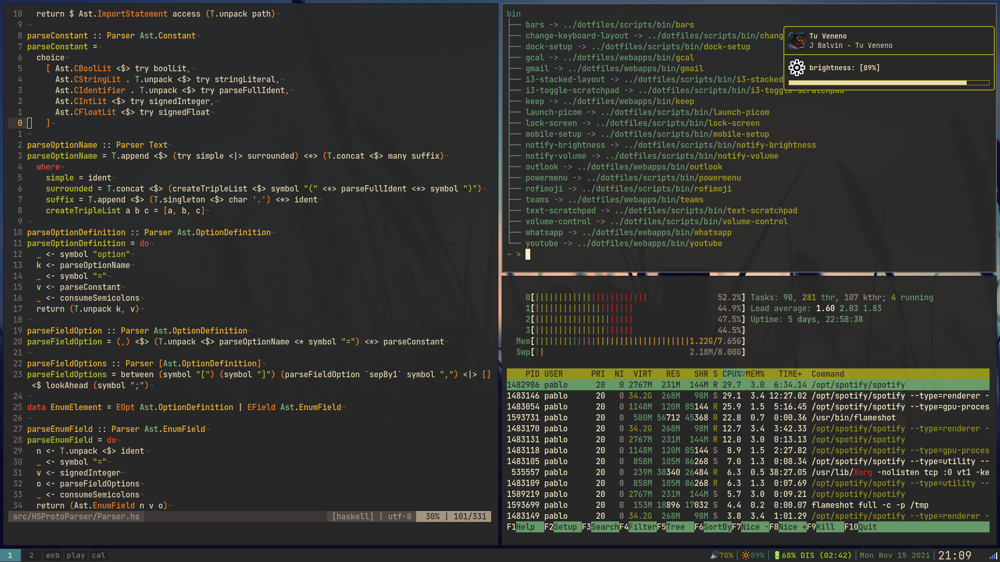

# My dotfiles

Arch Linux setup centered around practicality and minimalism.

* i3-gaps + i3lock + i3bar + i3status
* zsh (no oh-my-zsh), powerlevel10k prompt
* alacritty
* nvim
* bemenu
* dunst
* picom (no weird forks, just normal picom)
* gruvbox is life



Use at own risk, or actually don't use this at all, dotfiles are a very personal thing, write your own 😛.
The config can serve as inspiration, however, many hours of my life have been spent editing these files.

# Installation

## Prerequisites

- Fresh Arch install (no xorg installed yet)
- Basic packages like neovim, zsh, mlocate, network manager, man pages are installed
- User is created with zsh as login shell
- User is a sudoer
- Internet connection

## Download Installation Scripts

```sh
sudo pacman -S wget tar
cd ~
wget https://api.github.com/repos/pabloariasal/dotfiles/tarball/master -O dotfiles.tar.gz
tar -xzvf dotfiles.tar.gz
rm dotfiles.tar.gz
```
there is now a directory `pabloariasal-dotfiles-xxx` containing installation scripts and setup files.

## Install Xorg

```sh
cd pabloariasal-dotfiles-xxx
./system_setup install_xorg
```

### Setup xinit and zprofile

In order to launch i3-wm [xinit](https://wiki.archlinux.org/title/Xinit) needs to be setup. `startx` is called from `zprofile`.

```sh
sudo pacman -S xorg-xinit
cd pabloariasal-dotfiles-XXX
cp configs/xorg/.xinitrc ..
cp configs/zsh/.zprofile ..
cp configs/env/.env ..
```

## Install git

```sh
sudo pacman -S git
```

## Install i3-wm

```sh
cd pabloariasal-dotfiles-xxx
./system_setup install_i3_wm
```

## Install bemenu

```sh
sudo pacman -S bemenu
```

Select option "x11"

## Install paru

```sh
cd pabloariasal-dotfiles-xxx
./system_setup install_paru
```

## Install google-chrome

```sh
paru -S google-chrome
```

## Install alacritty

It's important to install a terminal before booting into i3-wm

```sh
sudo pacman -S alacritty
```

## Boot into i3-wm

Now we should be able to boot into i3-wm:

- Logout (Ctrl-d) and login back again
- Create a default config
- `mod+enter` opens a alacritty

## Generate ssh keys

```sh
sudo pacman -S xclip
cd pabloariasal-dotfiles-xxx
./system_setup create_github_personal_ssh_key
```

### Add ssh public key to github account

1. open a terminal
2. Start google chrome
3. Login into google and github
4. Enter public key in the clipboard in github account

### Start ssh Agent and add ssh key

```sh
eval "$(ssh-agent -s)"
ssh-add ~/.ssh/github_personal
```

## Clone dotfiles

```sh
cd pabloariasal-dotfiles-xxx
./system_setup clone_repo
cd ..
rm -rf pabloariasal-dotfiles-XXX
```

The dotfiles repo is now cloned to the home directory

## Shell Configuration

```sh
rm ~/.xinitrc ~/.zprofile ~/.env
cd dotfiles
sudo pacman -S stow
stow --verbose=2 -d configs -t ~ zsh
stow --verbose=2 -d configs -t ~ env
```

Close and reopen terminal

## xorg configuraton

```sh
rm ~/.xinitrc
cd dotfiles
install_config xorg
./system_setup install_keyboard_conf
```

## i3-wm configuration

```sh
rm -r ~/.config/i3/config
cd dotfiles
install_config i3
install_config i3status
```

Reload i3

## Fonts

```sh
cd dotfiles
./system_setup install_nerd_fonts
```

## git Configuration

```sh
cd dotfiles
install_config git
```

## Install Scripts

```sh
cd dotfiles
./system_setup install_scripts
```

## Install CLI Goodies

```sh
./system_setup install_command_line_goodies
install_config vifm
```

## Terminal Configuration

```sh
intall_config alacritty
```

## Neovim Configuration

```sh
sudo pacman -S words
intall_config nvim
```

## Compositor

```sh
sudo pacman -S picom
install_config picom
```

## `ssh-agent` service

```sh
cd dotfiles
install_config systemd
./system_setup enable_agent_service
```

## TLP

```sh
sudo pacman -S tlp
sudo systemctl enable tlp.service
```

## Wallpaper

```sh
sudo pacman -S nitrogen
cd dotfiles
sag
./system_setup install_wallpapers
```

Open nitrogen and add `~/wallpapers` as wallpaper directory (recursively), select a wallpaper.

## System Monitoring

```sh
sudo pacman -S htop
```

## PDFs, Image Viewer and Window Swallowing

```sh
sudo pacman -S zathura zathura-pdf-mupdf eog
cd dotfiles
./system_setup install_devour
```

`iv` and `za` in command line can be use to open PDFs and images!

## Clipboard Manager

```sh
pacman -S gpaste
```
## Hibernation

Setup hibernation as described [here](https://wiki.archlinux.org/title/Power_management/Suspend_and_hibernate#Configure_the_initramfs)

## Screenshots

```sh
sudo pacman -S flameshot
```

## Notifications

```sh
sudo pacman -S dunst libnotify gnome-themes-extra
install_config dunst
```

## Brightness and Audio Control

```sh
sudo pacman -S brightnessctl playerctl
```

## Pulseaudio

```sh
./system_setup install_pulseaudio
```

## Disable Bluetooth

```sh
sudo ./system-setup disable_bluetooth
```

## Flatpak

```sh
sudo pacman -S flatpak
flatpak remote-add --if-not-exists flathub https://flathub.org/repo/flathub.flatpakrepo
```

### Spotify

```sh
sudo pacman -S xdg-desktop-portal-gtk
flatpak install spotify
```

### Anki

```sh
flatpak install anki
```

## Development Tools

### C/C++

```sh
cd dotfiles
install_config gdb
./system_setup install_cpp_dev_tools
./system_setup setup_gdb
```

### Python

```sh
cd dotfiles
./system_setup install_python_language_server
```

### Lua

```sh
cd dotfiles
./system_setup install_lua_dev_tools
```

### Ruby

```sh
cd dotfiles
install_config gem
```

# Q & A

## Lazy loads installs treesitter every time

```sh
rm -rf ~/.local/share/nvim
```
